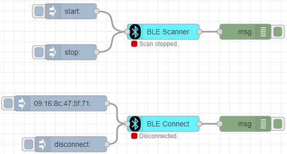

# node-red-contrib-ble-sense
Node-RED central module for Bluetooth Low Energy (BLE) devices. Speficially designed for environmental sensing peripherals such as Arduino Nano 33 BLE Sense.

Example Arduino code is provided in the following path `examples/bleSense/bleSense.ino`.

# Installation

```
npm install node-red-contrib-ble-sense
```

# Prerequisite

Requires [@abandonware/noble: 1.9.2-14.](https://www.npmjs.com/package/@abandonware/noble)

# Quick Start

The package currently contains two nodes: BLE Scanner, BLE Connect.

**BLE Scanner** node allows you to scan BLE devices. A message with **start** as a topic starts scanning. The node can output the following:
- Whole peripheral as an object.
- The MAC address of the peripheral.
- The advertisement data as a buffer array.

Hence **BLE Scanner** node can be used as an observer. This node also allows you to configure and search for a specific peripheral via given name.
To stop scanning a message with **stop** topic should be given.

**BLE Connect** node provides direct connection to the peripheral. This node must not be used alone. The scanning should be in progress to establish a connection.
It takes JSON Object as an input. The service and characteristics UUIDs should be provided. If not, it will try to subscribe all advertised characteristics.

The example input is shown below: 
```
{
    "services": [
        "181a"
    ],
    "characteristics": [
        "2a6e",
        "2a6f",
        "2a6d"
    ]
}
```

More details provided in Node-RED node information panel.

# Examples

An example flow that provides subscription to the all characteristics is given below.

</img>

# License

Licensed under the MIT [License](LICENSE).

## To Do:

- [x] Publish the 1st version of node-red-contrib-ble-sense.
- [ ] Add accelerometer, gyroscope, magnetometer, microphone data to Arduino code.
